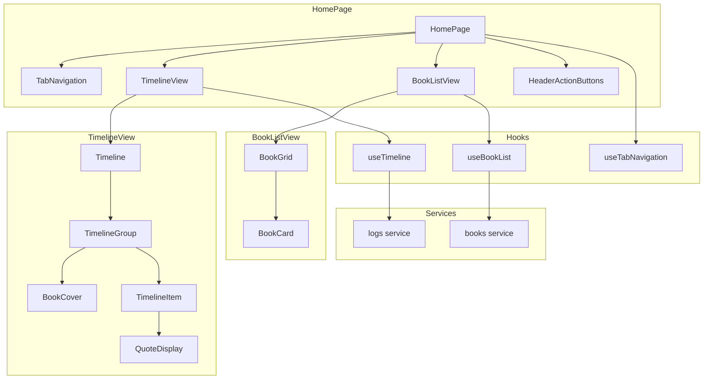

# Design Document: Timeline Redesign

## Overview

タイムラインと本一覧をタブで切り替え可能な統合ビューとして再設計する。Figma デザイン（node-id: 14:467）に基づき、縦ライン・ドットによるビジュアルタイムラインと書影表示を実現する。

**プロダクト名:** Logbook（「読書ログ」という名称は使用しない）

**主な変更:**
1. `HomePage` コンポーネントでタブナビゲーションを実装（「読書ログ」タイトル削除）
2. `TimelineView` / `BookListView` をタブ内コンテンツとして分離
3. 既存の Timeline コンポーネント群を Figma デザインに合わせてリファクタリング
4. 書影（coverUrl）のタイムライン表示対応
5. `Layout` ヘッダーのシンプル化（本アイコン追加、ナビリンク削除）
6. タイムラインのドット・縦ラインはログエントリのみに適用（本ヘッダーには適用しない）
7. **引用表示をFigmaデザインに準拠したグレー系スタイルに変更**
8. **ヘッダー下・タイムラインの上にユーザー情報（アイコン + ユーザー名）を表示**

## Steering Document Alignment

### Technical Standards (tech.md)
- **React 19 + TypeScript**: 既存のコンポーネントパターンを継承
- **Tailwind CSS**: Figma デザインの色・サイズを Tailwind クラスで実装
- **カスタムフック**: タブ状態管理用フック `useTabNavigation` を追加

### Project Structure (structure.md)
- `src/components/` 配下に新規コンポーネントを配置
- 既存の `Timeline/` ディレクトリを活用しつつリファクタリング
- `src/hooks/` にタブ管理フックを追加

## Code Reuse Analysis

### Existing Components to Leverage
- **`Timeline.tsx`**: グループ化ロジック（`groupLogsByBook`）を再利用
- **`TimelineGroup.tsx`**: 書影表示を追加してリファクタリング
- **`TimelineItem.tsx`**: Figma デザインに合わせて簡素化
- **`QuoteDisplay.tsx`**: 引用表示はスタイルを変更（amber→グレー系）
- **`BookListPage.tsx`**: 本一覧のデータ取得・表示ロジックを抽出
- **`QuickLogModal.tsx`**: ヘッダーの「ログを追加」ボタンから呼び出し

### Integration Points
- **`useTimeline` hook**: タイムラインデータ取得は既存を使用
- **`getBooks` service**: 本一覧データ取得は既存を使用
- **`useKeyboardShortcuts`**: Alt+H/Alt+B をタブ切り替えに対応

## Architecture



### Modular Design Principles
- **Single File Responsibility**: 各コンポーネントは単一の役割
  - `TabNavigation`: タブ UI の表示のみ
  - `TimelineView`: タイムライン表示のコンテナ
  - `BookListView`: 本一覧表示のコンテナ
- **Component Isolation**: タブ内コンテンツは独立してテスト可能
- **Service Layer Separation**: データ取得は既存 hooks/services を利用

## Components and Interfaces

### HomePage (新規)
- **Purpose:** タブナビゲーションとビューの切り替えを管理するメインページ
- **Location:** `src/pages/HomePage.tsx`
- **Changes:**
  - 「読書ログ」タイトル・サブタイトルを削除
  - ヘッダー下・タイムラインの上にユーザー情報（`UserInfo`）を表示
- **Interfaces:**
  ```typescript
  // 内部状態のみ、props なし
  export function HomePage(): JSX.Element
  ```
- **Dependencies:** `TabNavigation`, `TimelineView`, `BookListView`, `HeaderActionButtons`, `useTabNavigation`

### Layout (リファクタリング)
- **Purpose:** アプリケーション全体のレイアウト（ヘッダー、メインコンテンツ）
- **Location:** `src/components/common/Layout.tsx`
- **Changes:**
  - ヘッダー左側に本アイコン（SVG）を追加
  - ヘッダー右側のナビゲーションリンク（「Timeline」「Books」）を削除
- **Interfaces:**
  ```typescript
  interface LayoutProps {
    children: React.ReactNode;
  }
  ```
- **Dependencies:** React Router `Link`

### UserInfo (新規)
- **Purpose:** ヘッダー下・タイムラインの上に表示するユーザー情報（アイコン + ユーザー名）
- **Location:** `src/components/common/UserInfo.tsx`
- **Description:** 「誰の読書記録か」を示す重要な要素。現時点では固定のダミーデータを表示し、将来的に認証機能と連携予定。
- **Interfaces:**
  ```typescript
  interface UserInfoProps {
    name?: string;      // ユーザー名（デフォルト: "ゲスト"）
    avatarUrl?: string; // アバター画像URL（省略時はイニシャルアバター）
  }
  ```
- **Visual Design:**
  - アバター: 32x32px、円形、グレー背景（#ECECF0）にイニシャル表示
  - ユーザー名: 14px、グレー（#717182）
  - レイアウト: アバターとユーザー名を横並び、gap 8px
- **Default Behavior:**
  - name 未指定時: 「ゲスト」を表示
  - avatarUrl 未指定時: ユーザー名の最初の1文字をイニシャルとして表示
- **Implementation Example:**
  ```tsx
  <div className="flex items-center gap-2">
    {avatarUrl ? (
      
    ) : (
      <div className="w-8 h-8 rounded-full bg-gray-100 flex items-center justify-center text-sm text-gray-500 font-medium">
        {name?.charAt(0) || 'ゲ'}
      </div>
    )}
    <span className="text-sm text-gray-500">{name || 'ゲスト'}</span>
  </div>
  ```
- **Dependencies:** なし（純粋な UI コンポーネント）

### TabNavigation (新規)
- **Purpose:** タイムライン/本一覧のタブ切り替え UI
- **Location:** `src/components/common/TabNavigation.tsx`
- **Interfaces:**
  ```typescript
  interface TabNavigationProps {
    activeTab: 'timeline' | 'books';
    onTabChange: (tab: 'timeline' | 'books') => void;
  }
  ```
- **Dependencies:** なし（純粋な UI コンポーネント）

### HeaderActionButtons (新規)
- **Purpose:** 「ログを追加」「本を追加」ボタン群
- **Location:** `src/components/common/HeaderActionButtons.tsx`
- **Interfaces:**
  ```typescript
  interface HeaderActionButtonsProps {
    onAddLog: () => void;
  }
  ```
- **Dependencies:** `Button`, React Router `Link`

### TimelineView (新規)
- **Purpose:** タイムラインタブのコンテンツコンテナ
- **Location:** `src/components/Timeline/TimelineView.tsx`
- **Interfaces:**
  ```typescript
  export function TimelineView(): JSX.Element
  ```
- **Dependencies:** `Timeline`, `useTimeline`
- **Reuses:** 既存の `useTimeline` hook

### BookListView (新規)
- **Purpose:** 本一覧タブのコンテンツコンテナ
- **Location:** `src/components/BookList/BookListView.tsx`
- **Interfaces:**
  ```typescript
  export function BookListView(): JSX.Element
  ```
- **Dependencies:** `BookGrid`, `useBookList`
- **Reuses:** 既存の `BookListPage` のロジックを抽出

### BookGrid (新規)
- **Purpose:** 本一覧のグリッド表示
- **Location:** `src/components/BookList/BookGrid.tsx`
- **Interfaces:**
  ```typescript
  interface BookGridProps {
    books: BookWithLogCount[];
    onDelete?: (bookId: string) => Promise<void>;
  }
  ```
- **Dependencies:** `BookCard`

### BookCover (新規)
- **Purpose:** 書影のサムネイル表示
- **Location:** `src/components/common/BookCover.tsx`
- **Interfaces:**
  ```typescript
  interface BookCoverProps {
    coverUrl: string | null;
    title: string;
    size?: 'sm' | 'md' | 'lg';
    className?: string;
  }
  ```
- **Dependencies:** なし

### TimelineGroup (リファクタリング)
- **Purpose:** 本ごとのロググループ表示（書影追加）
- **Location:** `src/components/Timeline/TimelineGroup.tsx`
- **Changes:**
  - 書影サムネイル（`BookCover`）を追加
  - 本ヘッダーからドット・縦ラインを削除（ログエントリのみに表示）
  - 書影と本タイトルのみをヘッダーとして表示
  - **グループレベルの縦ラインを削除**（縦ラインは TimelineItem 内でのみ表示）
- **Interfaces:**
  ```typescript
  interface TimelineGroupProps {
    book: Book;
    logs: LogWithBook[];
    isLastGroup?: boolean;
  }
  ```
- **Dependencies:** `BookCover`, `TimelineItem`

**注:**
- 本ヘッダーにはドットや縦ラインを表示せず、書影と本情報のみを表示する
- 縦ラインは各 TimelineItem 内で個別に描画し、TimelineGroup では縦ラインを持たない（二重表示を防ぐ）

### TimelineItem (リファクタリング)
- **Purpose:** 個別ログエントリの表示（Figma デザインに合わせて簡素化）
- **Location:** `src/components/Timeline/TimelineItem.tsx`
- **Changes:**
  - カード枠を削除、シンプルな表示に変更
  - ドットスタイルを Figma に合わせて調整
  - 削除ボタンのみ残す（編集機能は本詳細ページで）
- **Interfaces:**
  ```typescript
  interface TimelineItemProps {
    log: Log;
    isLast?: boolean;
    onDelete?: (logId: string) => Promise<void>;
    isDeleting?: boolean;
  }
  ```

### QuoteDisplay (リファクタリング)
- **Purpose:** 引用タイプのログ表示
- **Location:** `src/components/Timeline/QuoteDisplay.tsx`
- **Changes:**
  - 背景色を削除（透明に）
  - 左ボーダー色を amber-400 → gray-200（#ECECF0）に変更
  - テキスト色を gray-700 → gray-500（#717182）に変更
  - イタリック体を維持
  - 角丸（rounded-r）を削除
- **Interfaces:**
  ```typescript
  interface QuoteDisplayProps {
    content: string;
  }
  ```
- **Before (現在):**
  ```tsx
  <blockquote className="border-l-4 border-amber-400 pl-4 py-1 italic text-gray-700 bg-amber-50/50 rounded-r">
  ```
- **After (Figma準拠):**
  ```tsx
  <blockquote className="border-l-4 border-gray-200 pl-5 italic text-gray-500">
  ```

### useTabNavigation (新規フック)
- **Purpose:** タブ状態管理とキーボードショートカット連携
- **Location:** `src/hooks/useTabNavigation.ts`
- **Interfaces:**
  ```typescript
  type TabType = 'timeline' | 'books';

  interface UseTabNavigationReturn {
    activeTab: TabType;
    setActiveTab: (tab: TabType) => void;
  }

  export function useTabNavigation(defaultTab?: TabType): UseTabNavigationReturn
  ```
- **Dependencies:** React hooks

### useBookList (新規フック)
- **Purpose:** 本一覧のデータ取得・削除処理
- **Location:** `src/hooks/useBookList.ts`
- **Interfaces:**
  ```typescript
  interface UseBookListReturn {
    books: BookWithLogCount[];
    isLoading: boolean;
    error: string | null;
    deleteBook: (bookId: string) => Promise<void>;
    refetch: () => Promise<void>;
  }

  export function useBookList(): UseBookListReturn
  ```
- **Dependencies:** `books` service
- **Reuses:** `BookListPage` のロジックを抽出

## Data Models

既存の型を使用。新規の型定義は不要。

### 使用する既存型
```typescript
// Book (types/index.ts)
interface Book {
  id: string;
  title: string;
  author: string | null;
  coverUrl: string | null;  // 書影表示に使用
  // ...
}

// LogWithBook (types/index.ts)
interface LogWithBook extends Log {
  book: Book;
}

// BookWithLogCount (types/index.ts)
interface BookWithLogCount extends Book {
  logCount: number;
}
```

### 新規型（ローカル定義）
```typescript
// TabType (useTabNavigation.ts 内)
type TabType = 'timeline' | 'books';
```

## UI Design Details

### カラーパレット（Figma node-id: 14:467 より）
| 用途 | 色 | Tailwind |
|------|-----|----------|
| 背景 | #FFFFFF | `bg-white` |
| タブ背景（非選択） | #ECECF0 | `bg-gray-100` |
| テキスト（メイン） | #0A0A0A | `text-gray-900` |
| テキスト（サブ） | #717182 | `text-gray-500` |
| ドット（ログ） | #717182 | `bg-gray-500` |
| ドット（引用） | #717182 border | `border-2 border-gray-500 bg-transparent` |
| 縦ライン | rgba(0,0,0,0.1) | `bg-black/10` |
| 引用ボーダー | #ECECF0 | `border-gray-200` |
| 引用テキスト | #717182 | `text-gray-500` |
| ボタン（プライマリ） | #030213 | `bg-gray-900` |
| 書影背景（フォールバック） | #ECECF0 | `bg-gray-100` |
| ユーザーアバター背景 | #ECECF0 | `bg-gray-100` |
| ユーザー名テキスト | #717182 | `text-gray-500` |

### サイズ仕様（Figma node-id: 14:467 より）
| 要素 | サイズ | Tailwind |
|------|--------|----------|
| タブ高さ | 36px | `h-9` |
| タブ角丸 | 14px | `rounded-[14px]` |
| ドット | 16px | `w-4 h-4` |
| 縦ライン幅 | 2px | `w-0.5` |
| 書影サムネイル | 48x64px | `w-12 h-16` |
| 書影角丸 | 4px | `rounded` |
| ログ本文 | 16px / line-height 26px | `text-base leading-relaxed` |
| タイムスタンプ | 14px | `text-sm` |
| 削除アイコン | 16px | `w-4 h-4` |
| 本タイトル | 18px / bold | `text-lg font-bold` |
| 著者名 | 14px | `text-sm` |
| 引用左ボーダー | 4px | `border-l-4` |
| 引用左パディング | 20px | `pl-5` |
| ユーザーアバター | 32x32px | `w-8 h-8` |
| ユーザー名 | 14px | `text-sm` |
| アバターとユーザー名の間隔 | 8px | `gap-2` |

### コンポーネント間のスペーシング
| 要素間 | 間隔 | Tailwind |
|--------|------|----------|
| 本ヘッダーとログ | 24px | `mb-6` |
| ログ間 | 24px | `pb-6` |
| 本グループ間 | 32px | `mb-8` |
| 書影と本情報 | 12px | `gap-3` |
| ドットとコンテンツ | 32px | `pl-8` |

**注:** 本ヘッダーにはドットを表示しないため、「ドット（本）」の定義は削除。

## Visual Reference

### ログエントリのレイアウト（Figmaより）
```
┌─────────────────────────────────────────────────────┐
│ ●  ログ本文テキスト（16px、line-height 26px）         🗑 │
│ │  複数行にわたる場合は折り返して表示される           │
│ │  2025年12月16日 20:53 (14px, gray)                │
│ │                                                    │
│ │                                                    │
│ ○  「これは引用です」(italic, gray, border-left)   🗑 │
│    2025年12月16日 19:41                              │
└─────────────────────────────────────────────────────┘

凡例:
● = 通常ログのドット（塗りつぶし）
○ = 引用ログのドット（ボーダーのみ）
│ = 縦ライン（rgba(0,0,0,0.1)）
🗑 = 削除ボタン（ホバー時のみ表示）
```

### 本ヘッダーのレイアウト（Figmaより）
```
┌─────────────────────────────────────────────────────┐
│ ┌────┐  本のタイトル (18px, bold)                    │
│ │ 📖 │  著者名 (14px, gray)                          │
│ └────┘                                               │
└─────────────────────────────────────────────────────┘

凡例:
📖 = 書影サムネイル (48x64px) or デフォルトアイコン
※ 本ヘッダーにはドット・縦ラインなし
```

### ヘッダーのレイアウト
```
┌─────────────────────────────────────────────────────┐
│ 📖 Logbook                                          │
└─────────────────────────────────────────────────────┘

凡例:
📖 = 本アイコン（SVG）
```

### ユーザー情報のレイアウト（ヘッダー下・タイムラインの上）
```
(●) ゲスト

凡例:
(●) = ユーザーアバター（32x32px、円形、イニシャル表示）
ゲスト = ユーザー名（14px、グレー）
※ 「このタイムラインが誰の読んだ本の記録か」を示す
```

## Error Handling

### Error Scenarios
1. **タイムライン読み込み失敗**
   - **Handling:** `useTimeline` の既存エラーハンドリングを継続
   - **User Impact:** エラーメッセージと再読み込みボタンを表示

2. **本一覧読み込み失敗**
   - **Handling:** `useBookList` でエラー状態を管理
   - **User Impact:** エラーメッセージと再読み込みボタンを表示

3. **書影画像の読み込み失敗**
   - **Handling:** `BookCover` コンポーネントで `onError` をハンドル
   - **User Impact:** デフォルトの本アイコンにフォールバック

## Testing Strategy

### Unit Testing
- `TabNavigation`: タブクリックで正しいコールバックが呼ばれるか
- `BookCover`: coverUrl の有無でレンダリングが切り替わるか
- `QuoteDisplay`: 新しいスタイル（グレー系）で正しくレンダリングされるか
- `UserInfo`: name/avatarUrl の有無で正しくレンダリングされるか
- `useTabNavigation`: 初期値とタブ切り替えの状態管理
- `useBookList`: データ取得・削除・エラーハンドリング

### Integration Testing
- `HomePage`: タブ切り替えで正しいビューが表示されるか
- `TimelineView`: データフェッチからレンダリングまでの流れ
- `BookListView`: データフェッチからレンダリングまでの流れ

### End-to-End Testing
- タイムラインタブでログが正しく表示される
- 本一覧タブで本が正しく表示される
- タブ切り替えがスムーズに動作する
- 「ログを追加」ボタンでモーダルが開く
- 「本を追加」ボタンで本登録ページに遷移する
- キーボードショートカット（Alt+H, Alt+B）が動作する
- 引用ログが正しいスタイル（グレー系）で表示される
- ヘッダー下・タイムラインの上にユーザー情報（アバター + ユーザー名）が表示される

## Migration Notes

### ルーティング変更
- `/` → `HomePage`（タイムライン + 本一覧の統合ビュー）
- `/books` → 削除（`HomePage` の本一覧タブに統合）
- `/books/new`, `/books/:id` → 変更なし

### 既存ページの扱い
- `TimelinePage.tsx` → 削除または `TimelineView` に統合
- `BookListPage.tsx` → ロジックを `useBookList` と `BookListView` に分離後、削除検討

### キーボードショートカット
- `Alt+H`: タイムラインタブをアクティブに
- `Alt+B`: 本一覧タブをアクティブに
- `useKeyboardShortcuts` を更新して `useTabNavigation` と連携

### スタイル変更（QuoteDisplay）
- **Before:** `border-amber-400 bg-amber-50/50 text-gray-700 rounded-r`
- **After:** `border-gray-200 text-gray-500`（背景・角丸なし）
