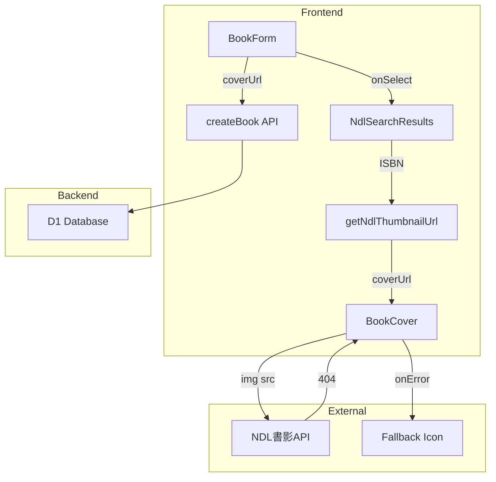

# Design Document

## Overview

本機能は、国立国会図書館サーチ（NDLサーチ）の書影APIを活用し、ISBNを持つ本の表紙画像を自動取得・表示する機能です。

既存のBookCoverコンポーネントとcoverUrlフィールドを活用し、最小限の変更で書影表示を実現します。主な変更点は:
1. ISBNからNDL書影URLを生成するユーティリティ関数の追加
2. NDL検索結果での書影プレビュー表示
3. 本登録時の書影URL自動設定

## Steering Document Alignment

### Technical Standards (tech.md)
- **TypeScript**: 型安全なユーティリティ関数を実装
- **React**: 既存のBookCoverコンポーネントを再利用
- **Cloudflare Workers**: APIプロキシは不要（フロントエンドから直接NDL書影URLを参照）

### Project Structure (structure.md)
- **src/lib/**: 書影URL生成ユーティリティを配置
- **src/components/common/BookCover.tsx**: 既存コンポーネントを活用（変更不要）
- **src/components/BookForm/NdlSearchResults.tsx**: 書影プレビューを追加

## Code Reuse Analysis

### Existing Components to Leverage
- **BookCover.tsx**: 書影表示・フォールバック処理が既に実装済み。coverUrlを渡すだけで動作
- **NdlSearchResults.tsx**: NDL検索結果表示。書影表示を追加
- **BookForm.tsx**: 本登録フォーム。NDL選択時の書影URL設定を追加

### Integration Points
- **types/index.ts**: Book型に既にcoverUrlフィールドが存在
- **services/books.ts**: createBook時にcoverUrlを送信可能
- **functions/api/books/**: coverUrlの保存は既にサポート済み

## Architecture



### データフロー

1. **NDL検索時**: 検索結果にISBNがあれば、`getNdlThumbnailUrl(isbn)`で書影URLを生成し、BookCoverで表示
2. **本登録時**: NDL検索結果を選択すると、書影URLがcoverUrlとして設定され、DBに保存
3. **本表示時**: DBから取得したcoverUrlをBookCoverに渡して表示

## Components and Interfaces

### getNdlThumbnailUrl (Utility Function)
- **Purpose:** ISBNからNDL書影URLを生成
- **Location:** `src/lib/ndl.ts`（新規ファイル）
- **Interfaces:**
  ```typescript
  function getNdlThumbnailUrl(isbn: string | null): string | null
  ```
- **Dependencies:** なし（純粋関数）
- **Reuses:** なし

### NdlSearchResults (Component Update)
- **Purpose:** NDL検索結果に書影プレビューを追加
- **Location:** `src/components/BookForm/NdlSearchResults.tsx`
- **Changes:**
  - BookCoverコンポーネントをインポート
  - 各検索結果にBookCoverを表示
- **Dependencies:** BookCover, getNdlThumbnailUrl
- **Reuses:** BookCover（既存）

### BookForm (Component Update)
- **Purpose:** NDL選択時に書影URLを自動設定
- **Location:** `src/components/BookForm/BookForm.tsx`
- **Changes:**
  - handleNdlSelectでcoverUrlを設定
- **Dependencies:** getNdlThumbnailUrl
- **Reuses:** 既存のフォームロジック

## Data Models

### 既存モデル（変更なし）

```typescript
// Book型（coverUrlフィールド既存）
interface Book {
  id: string;
  title: string;
  author: string | null;
  publisher: string | null;
  isbn: string | null;
  coverUrl: string | null;  // ← 書影URLをここに保存
  ndlBibId: string | null;
  isDeleted: boolean;
  createdAt: string;
  updatedAt: string;
}

// NdlBook型（変更なし）
interface NdlBook {
  title: string;
  author: string | null;
  publisher: string | null;
  isbn: string | null;
  pubDate: string | null;
  ndlBibId: string;
}
```

### NDL書影URL生成ロジック

```typescript
const NDL_THUMBNAIL_BASE = 'https://ndlsearch.ndl.go.jp/thumbnail';

function getNdlThumbnailUrl(isbn: string | null): string | null {
  if (!isbn) return null;

  // ハイフン・スペースを除去し、13桁のISBNに正規化
  const normalizedIsbn = isbn.replace(/[-\s]/g, '');

  // 10桁または13桁のISBNのみ有効
  if (!/^\d{10}$|^\d{13}$/.test(normalizedIsbn)) {
    return null;
  }

  return `${NDL_THUMBNAIL_BASE}/${normalizedIsbn}.jpg`;
}
```

## Error Handling

### Error Scenarios

1. **書影が存在しない（404）**
   - **Handling:** BookCoverコンポーネントのonErrorでフォールバック表示
   - **User Impact:** 本アイコンが表示される（既存動作）

2. **ISBNが無効または存在しない**
   - **Handling:** getNdlThumbnailUrlがnullを返す
   - **User Impact:** フォールバックアイコンが表示される

3. **ネットワークエラー**
   - **Handling:** img要素のonErrorでキャッチ
   - **User Impact:** フォールバックアイコンが表示される

4. **NDL APIが一時的に利用不可**
   - **Handling:** 画像読み込みエラーとして処理
   - **User Impact:** フォールバックアイコン表示、アプリは正常動作継続

## Testing Strategy

### Unit Testing
- `getNdlThumbnailUrl`関数のテスト
  - 有効なISBN-13でURLが生成される
  - 有効なISBN-10でURLが生成される
  - ハイフン付きISBNが正規化される
  - nullまたは無効なISBNでnullが返る

### Integration Testing
- NdlSearchResultsコンポーネントのテスト
  - ISBNがある結果に書影が表示される
  - ISBNがない結果にフォールバックが表示される
- BookFormコンポーネントのテスト
  - NDL選択時にcoverUrlが設定される

### End-to-End Testing
- 本登録フロー
  1. NDL検索で本を検索
  2. 検索結果に書影が表示される
  3. 本を選択して登録
  4. 本一覧で書影が表示される
