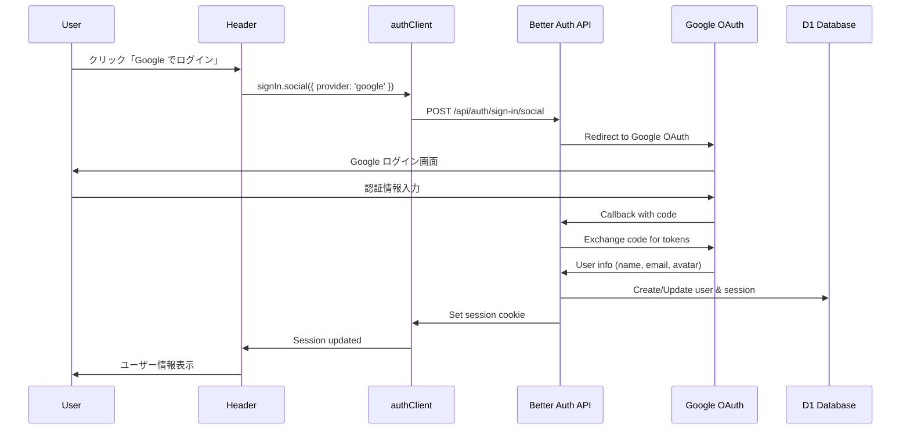
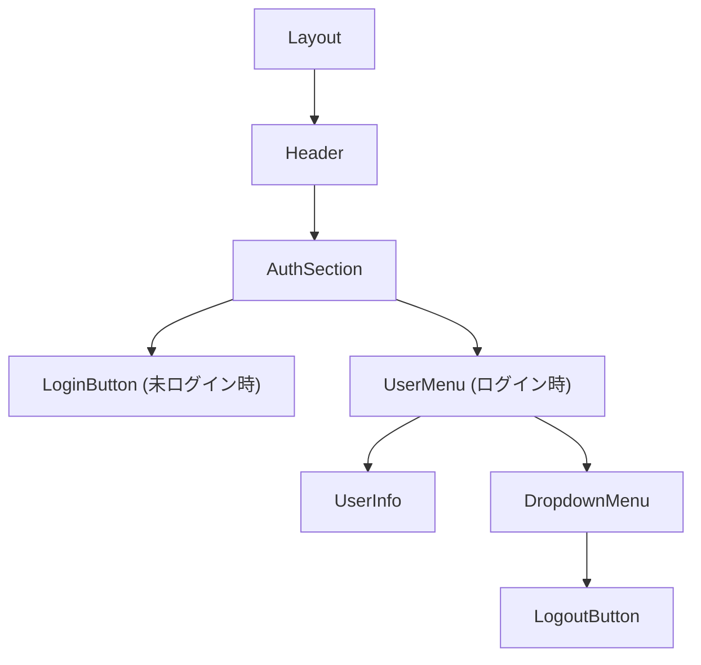

# Design Document

## Overview

Better Auth を採用し、Google ソーシャルログインを実装する。Cloudflare Workers + Hono + D1 環境で動作し、ヘッダー右上にログイン状態に応じた UI を表示する。メール/パスワード認証や他のソーシャルログインは将来の拡張として対応可能な設計とする。

## Steering Document Alignment

### Technical Standards (tech.md)
- **Hono フレームワーク**: Better Auth の Hono 統合を使用
- **Drizzle ORM**: Better Auth の Drizzle アダプターで既存スキーマに追加
- **TypeScript**: Better Auth は TypeScript ファーストで型安全

### Project Structure (structure.md)
- `src/components/common/`: LoginButton, UserMenu コンポーネント追加
- `src/hooks/`: useAuth フック追加（Better Auth クライアント）
- `src/lib/auth-client.ts`: Better Auth React クライアント
- `functions/lib/auth.ts`: Better Auth サーバーインスタンス
- `db/schema.ts`: Better Auth 自動生成スキーマを追加

## Technology Selection: Better Auth

### 採用理由
- **Hono 公式統合**: Cloudflare Workers での実績あり
- **Drizzle アダプター**: 既存の DB 構成と親和性が高い
- **D1 対応**: SQLite dialect でサポート
- **型安全**: TypeScript ファーストで設計
- **拡張性**: 将来的に他のソーシャルログインを簡単に追加可能

### 必要パッケージ
```bash
npm install better-auth
npm install -D @better-auth/cli
```

## Code Reuse Analysis

### Existing Components to Leverage
- **Button**: 「Google でログイン」ボタンに使用
- **Layout**: ヘッダー右上にログイン状態 UI を追加
- **UserInfo**: ログイン後のユーザー表示に活用（既存コンポーネント）
- **Toast**: 認証エラー通知に使用

### Integration Points
- **Layout.tsx**: ヘッダー右上に LoginButton/UserMenu を追加
- **db/schema.ts**: Better Auth スキーマを統合
- **functions/api/**: Better Auth ハンドラーを追加

## Architecture

### Google OAuth フロー



### コンポーネント階層



### ファイル構成

```
src/
├── lib/
│   └── auth-client.ts        # Better Auth React クライアント
├── hooks/
│   └── useAuth.ts            # 認証状態フック
├── components/
│   └── common/
│       ├── Layout.tsx        # ヘッダーに AuthSection 追加
│       ├── LoginButton.tsx   # 「Google でログイン」ボタン
│       └── UserMenu.tsx      # ログイン後のユーザーメニュー

functions/
├── lib/
│   └── auth.ts               # Better Auth サーバーインスタンス
├── api/
│   └── auth/
│       └── [...all].ts       # Better Auth キャッチオールハンドラー

db/
└── schema.ts                 # Better Auth スキーマ追加
```

## Components and Interfaces

### Better Auth Server Instance
- **Location**: `functions/lib/auth.ts`
- **Configuration**:
  ```typescript
  import { betterAuth } from 'better-auth';
  import { drizzleAdapter } from 'better-auth/adapters/drizzle';

  export function createAuth(env: Env) {
    const db = drizzle(env.DB);
    return betterAuth({
      database: drizzleAdapter(db, {
        provider: 'sqlite',
      }),
      socialProviders: {
        google: {
          clientId: env.GOOGLE_CLIENT_ID,
          clientSecret: env.GOOGLE_CLIENT_SECRET,
        },
      },
      trustedOrigins: [env.BETTER_AUTH_URL],
    });
  }
  ```

### Better Auth Client
- **Location**: `src/lib/auth-client.ts`
- **Implementation**:
  ```typescript
  import { createAuthClient } from 'better-auth/react';

  export const authClient = createAuthClient({
    baseURL: '/api/auth',
  });

  // 使用例
  // authClient.signIn.social({ provider: 'google' })
  // authClient.signOut()
  // authClient.useSession()
  ```

### useAuth Hook
- **Location**: `src/hooks/useAuth.ts`
- **Interfaces**:
  ```typescript
  interface UseAuthReturn {
    user: {
      id: string;
      name: string;
      email: string;
      image: string | null;
    } | null;
    isAuthenticated: boolean;
    isLoading: boolean;
    signInWithGoogle: () => Promise<void>;
    signOut: () => Promise<void>;
  }
  ```

### LoginButton
- **Location**: `src/components/common/LoginButton.tsx`
- **Design**:
  ```typescript
  // Google ブランドガイドラインに準拠したボタン
  // - Google ロゴ + 「Google でログイン」テキスト
  // - 白背景、グレーボーダー
  ```
- **Behavior**: クリックで `signInWithGoogle()` を呼び出し

### UserMenu
- **Location**: `src/components/common/UserMenu.tsx`
- **Design**:
  - Google アバター画像（丸型）
  - ユーザー名（省略可能）
  - クリックでドロップダウン表示
  - ドロップダウン内に「ログアウト」

### Layout 更新
- **Location**: `src/components/common/Layout.tsx`
- **Changes**:
  ```typescript
  // ヘッダーに認証セクションを追加
  <header>
    <Link to="/">Logbook</Link>
    <div className="auth-section">
      {isAuthenticated ? (
        <UserMenu user={user} onLogout={signOut} />
      ) : (
        <LoginButton onClick={signInWithGoogle} />
      )}
    </div>
  </header>
  ```

### Auth API Handler
- **Location**: `functions/api/auth/[...all].ts`
- **Endpoints** (Better Auth 自動提供):
  - `GET /api/auth/sign-in/social?provider=google` - Google ログイン開始
  - `GET /api/auth/callback/google` - Google コールバック
  - `POST /api/auth/sign-out` - ログアウト
  - `GET /api/auth/session` - セッション取得

## Data Models

### Better Auth 自動生成スキーマ

```bash
npx @better-auth/cli generate
```

生成されるテーブル:

```typescript
// db/schema.ts に追加

export const users = sqliteTable('users', {
  id: text('id').primaryKey(),
  name: text('name').notNull(),
  email: text('email').notNull().unique(),
  emailVerified: integer('email_verified', { mode: 'boolean' }).notNull(),
  image: text('image'),
  createdAt: integer('created_at', { mode: 'timestamp' }).notNull(),
  updatedAt: integer('updated_at', { mode: 'timestamp' }).notNull(),
});

export const sessions = sqliteTable('sessions', {
  id: text('id').primaryKey(),
  expiresAt: integer('expires_at', { mode: 'timestamp' }).notNull(),
  token: text('token').notNull().unique(),
  createdAt: integer('created_at', { mode: 'timestamp' }).notNull(),
  updatedAt: integer('updated_at', { mode: 'timestamp' }).notNull(),
  ipAddress: text('ip_address'),
  userAgent: text('user_agent'),
  userId: text('user_id').notNull().references(() => users.id),
});

export const accounts = sqliteTable('accounts', {
  id: text('id').primaryKey(),
  accountId: text('account_id').notNull(),
  providerId: text('provider_id').notNull(),  // 'google'
  userId: text('user_id').notNull().references(() => users.id),
  accessToken: text('access_token'),
  refreshToken: text('refresh_token'),
  idToken: text('id_token'),
  accessTokenExpiresAt: integer('access_token_expires_at', { mode: 'timestamp' }),
  refreshTokenExpiresAt: integer('refresh_token_expires_at', { mode: 'timestamp' }),
  scope: text('scope'),
  password: text('password'),
  createdAt: integer('created_at', { mode: 'timestamp' }).notNull(),
  updatedAt: integer('updated_at', { mode: 'timestamp' }).notNull(),
});

export const verifications = sqliteTable('verifications', {
  id: text('id').primaryKey(),
  identifier: text('identifier').notNull(),
  value: text('value').notNull(),
  expiresAt: integer('expires_at', { mode: 'timestamp' }).notNull(),
  createdAt: integer('created_at', { mode: 'timestamp' }),
  updatedAt: integer('updated_at', { mode: 'timestamp' }),
});
```

## Session Management

### Cookie-based Session (Better Auth デフォルト)
- **Cookie名**: `better-auth.session_token`
- **属性**:
  - `HttpOnly`: true
  - `Secure`: true
  - `SameSite`: Lax
  - `Path`: /
- **有効期限**: 30日間（日常的に使うアプリのため長めに設定）

## Environment Variables

### Google OAuth 設定

Google Cloud Console で OAuth 2.0 クライアントを作成:
1. https://console.cloud.google.com/apis/credentials
2. 「OAuth 2.0 クライアント ID」を作成
3. 承認済みリダイレクト URI に追加:
   - ローカル: `http://localhost:8787/api/auth/callback/google`
   - 本番: `https://logbook-hmk.pages.dev/api/auth/callback/google`

### 環境変数

```bash
# .dev.vars (ローカル開発)
BETTER_AUTH_SECRET=your-random-secret-key
BETTER_AUTH_URL=http://localhost:8787
GOOGLE_CLIENT_ID=your-google-client-id
GOOGLE_CLIENT_SECRET=your-google-client-secret
```

```bash
# 本番環境

# wrangler.jsonc の vars セクションに追加（公開情報）
# "BETTER_AUTH_URL": "https://logbook-hmk.pages.dev"

# Cloudflare Secrets として設定（機密情報）
# wrangler secret put BETTER_AUTH_SECRET
# wrangler secret put GOOGLE_CLIENT_ID
# wrangler secret put GOOGLE_CLIENT_SECRET
```

**補足**: `BETTER_AUTH_URL` は OAuth コールバック URL の生成に使用されるため、ローカルと本番で異なる値を設定する必要があります。

## Error Handling

### Error Scenarios
1. **Google 認証キャンセル**
   - **Handling**: Better Auth がエラーを返す
   - **User Impact**: 元のページに戻り、未ログイン状態を維持

2. **Google 認証失敗**
   - **Handling**: エラーをキャッチし Toast 表示
   - **User Impact**: 「ログインに失敗しました。再試行してください」

3. **セッション期限切れ**
   - **Handling**: `useSession()` が null を返す
   - **User Impact**: 自動的にログインボタン表示に切り替わる

4. **ネットワークエラー**
   - **Handling**: authClient がエラーをスロー
   - **User Impact**: Toast で「通信エラーが発生しました」

## Testing Strategy

### Unit Testing
- `useAuth` フックのテスト（モック authClient）
- LoginButton/UserMenu の表示切り替えテスト
- Layout の認証状態による UI 変化テスト

### Integration Testing
- Google OAuth コールバック処理のテスト
- セッション永続化のテスト

### Manual Testing
- 実際の Google アカウントでのログインフロー
- ログアウト → 再ログインのフロー
- ブラウザ再起動後のセッション復元

## Future Extensibility

### 他のソーシャルログイン追加

```typescript
// GitHub を追加する場合
socialProviders: {
  google: { ... },
  github: {
    clientId: env.GITHUB_CLIENT_ID,
    clientSecret: env.GITHUB_CLIENT_SECRET,
  },
},
```

### メール/パスワード認証追加

```typescript
emailAndPassword: {
  enabled: true,
},
```

## References

- [Better Auth 公式ドキュメント](https://www.better-auth.com/)
- [Better Auth Google Provider](https://www.better-auth.com/docs/authentication/google)
- [Hono + Better Auth on Cloudflare](https://hono.dev/examples/better-auth-on-cloudflare)
- [Google OAuth 2.0 設定](https://console.cloud.google.com/apis/credentials)
