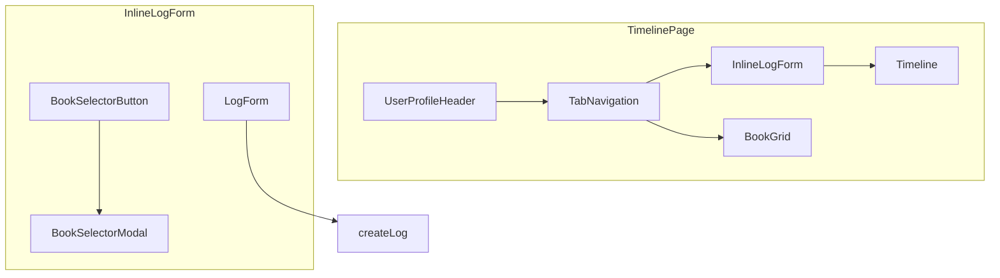

# Design Document

## Overview

タイムラインページ（`/u/:username`）のレイアウトを再設計し、ユーザープロフィールを中心とした視覚的に統一感のある構成へ変更する。また、自分のタイムラインでは常にインラインログ入力フォームを表示し、読書中でも素早くログを記録できる体験を提供する。

## Steering Document Alignment

### Technical Standards (tech.md)

- **React 19 + TypeScript**: 既存のコンポーネントパターンに従い、関数コンポーネント + hooks を使用
- **Tailwind CSS 4**: ユーティリティファーストでスタイリング、カスタム CSS は不要
- **Storybook 10**: 新規コンポーネントには Stories を作成

### Project Structure (structure.md)

- **コンポーネント配置**: `src/components/Timeline/` に新コンポーネントを追加
- **命名規則**: PascalCase でコンポーネント命名
- **Barrel Exports**: `index.ts` でエクスポート管理

## Code Reuse Analysis

### Existing Components to Leverage

| コンポーネント | 再利用方法 |
|---------------|-----------|
| `LogForm` | インラインログ入力で直接使用 |
| `Modal` | 本選択モーダルで使用 |
| `Loading` | ローディング表示で使用 |
| `Button` | 本選択ボタンで使用 |
| `TabNavigation` | 既存のものを中央配置で使用（変更不要） |

### Existing Hooks/Services to Leverage

| Hook/Service | 用途 |
|-------------|-----|
| `usePublicUserData` | ユーザー情報、ログ、本の取得（既存） |
| `createLog` (service) | ログ作成 API 呼び出し |
| `useAuth` | 現在のユーザー情報取得 |

### Integration Points

- **TimelinePage**: 既存ページコンポーネントを修正
- **API**: 既存の `/api/logs` を使用、新規 API 不要

## Architecture



### Modular Design Principles

- **Single File Responsibility**: 各新コンポーネントは1つの役割のみ担当
- **Component Isolation**: `UserProfileHeader`、`InlineLogForm`、`BookSelectorModal` を独立コンポーネントとして作成
- **Service Layer Separation**: ログ作成は既存の `createLog` サービスを使用

## Components and Interfaces

### UserProfileHeader

- **Purpose**: ユーザーアイコンとハンドルネームを中央に大きく表示
- **Location**: `src/components/Timeline/UserProfileHeader.tsx`
- **Interfaces**:
  ```typescript
  interface UserProfileHeaderProps {
    username: string;
    avatarUrl?: string;
  }
  ```
- **Dependencies**: なし（純粋な表示コンポーネント）
- **Reuses**: なし（新規作成）

### InlineLogForm

- **Purpose**: タイムライン上部に常時表示されるログ入力フォーム
- **Location**: `src/components/LogForm/InlineLogForm.tsx`
- **Interfaces**:
  ```typescript
  interface InlineLogFormProps {
    books: Book[];
    defaultBook: Book | null;
    onSuccess: () => void;
  }
  ```
- **Dependencies**: `LogForm`, `BookSelectorModal`, `createLog`
- **Reuses**: `LogForm`（入力フォーム部分）

### BookSelectorModal

- **Purpose**: 本を選択するためのモーダル
- **Location**: `src/components/LogForm/BookSelectorModal.tsx`
- **Interfaces**:
  ```typescript
  interface BookSelectorModalProps {
    isOpen: boolean;
    onClose: () => void;
    books: Book[];
    selectedBook: Book | null;
    onSelect: (book: Book) => void;
  }
  ```
- **Dependencies**: `Modal`
- **Reuses**: `Modal`、`QuickLogModal` の本選択 UI ロジック

### TimelinePage (Modified)

- **Purpose**: タイムラインページ全体のレイアウト
- **Location**: `src/pages/TimelinePage.tsx`（既存ファイル修正）
- **Changes**:
  1. ヘッダー部分を `UserProfileHeader` + 中央配置 `TabNavigation` に変更
  2. `HeaderActionButtons` を削除
  3. タイムラインタブで `isOwner` の場合に `InlineLogForm` を表示
  4. `QuickLogModal` を削除

## Data Models

### 既存モデルの使用

新しいデータモデルは不要。以下の既存モデルを使用：

- `Book`: 本の情報
- `LogWithBook`: ログ + 本の情報（タイムライン表示）
- `CreateLogRequest`: ログ作成リクエスト

### デフォルト本の決定ロジック

```typescript
function getDefaultBook(logs: LogWithBook[], books: Book[]): Book | null {
  // 1. タイムラインの最新ログの本を使用
  if (logs.length > 0) {
    return logs[0].book;
  }
  // 2. ログがない場合は本一覧の最初
  if (books.length > 0) {
    return books[0];
  }
  // 3. 本がない場合は null
  return null;
}
```

## Error Handling

### Error Scenarios

1. **ログ作成失敗**
   - **Handling**: `LogForm` 内でエラーメッセージを表示（既存ロジック）
   - **User Impact**: フォーム上部にエラーメッセージが表示される

2. **本が登録されていない**
   - **Handling**: `InlineLogForm` でメッセージと本登録リンクを表示
   - **User Impact**: 「本を登録してください」というメッセージと本登録ページへのリンクが表示される

## Testing Strategy

### Unit Testing

- `UserProfileHeader`: Props に応じた表示の確認
- `InlineLogForm`: 本選択、フォーム送信の動作確認
- `BookSelectorModal`: モーダル開閉、本選択の動作確認

### Storybook

各新コンポーネントに Stories を作成：
- `UserProfileHeader.stories.tsx`
- `InlineLogForm.stories.tsx`
- `BookSelectorModal.stories.tsx`

### Integration Testing

- `TimelinePage`: 自分のタイムラインでインラインフォームが表示されることを確認
- `TimelinePage`: 他ユーザーのタイムラインでインラインフォームが表示されないことを確認

## UI Layout

### Before (Current)

```
┌─────────────────────────────────────────┐
│ [Avatar] @username    [ログ追加] [本追加] │
├─────────────────────────────────────────┤
│ [タイムライン] [本の一覧]                  │
├─────────────────────────────────────────┤
│ Timeline Content...                      │
└─────────────────────────────────────────┘
```

### After (New Design)

```
┌─────────────────────────────────────────┐
│              [Large Avatar]              │
│               @username                  │
│                                          │
│         [タイムライン] [本の一覧]          │
├─────────────────────────────────────────┤
│  ┌──────────────────────────────────┐   │  ← isOwner かつ
│  │ [本を選択] 📖 本のタイトル        │   │    タイムラインタブ時のみ
│  │ ┌────────────────────────────┐   │   │
│  │ │ ログ入力テキストエリア       │   │   │
│  │ └────────────────────────────┘   │   │
│  │                        [保存]    │   │
│  └──────────────────────────────────┘   │
├─────────────────────────────────────────┤
│ Timeline Content...                      │
└─────────────────────────────────────────┘
```
