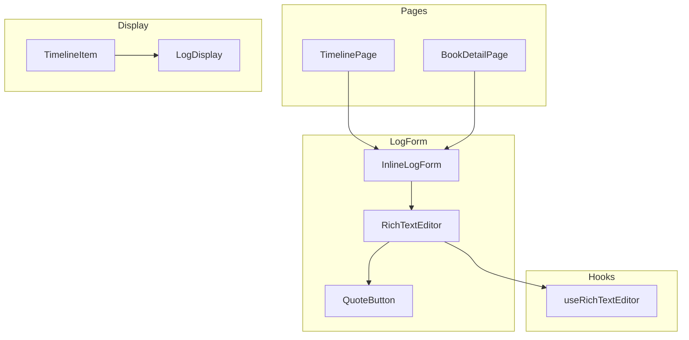
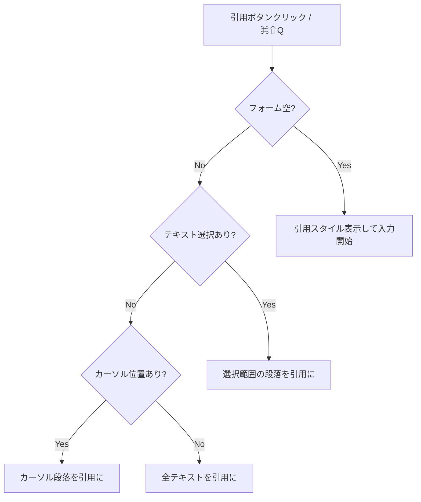

# Design Document: Unified Log

## Overview

本機能は、ログのメモ/引用の区別を廃止し、1つのログ内で任意の段落を「引用箇所」としてマークできるリッチテキスト形式に変更する。入力フォームはボーダーレスデザインで、引用ボタンとキーボードショートカットで引用を設定できる。

## Steering Document Alignment

### Technical Standards (tech.md)

- **React 19 + TypeScript**: 既存のコンポーネント設計パターンに従う
- **Tailwind CSS 4**: 引用スタイルは既存の `QuoteDisplay` のスタイルを踏襲
- **Hono API**: 既存のログ CRUD API を拡張
- **Drizzle ORM**: スキーマ変更は D1 マイグレーションで管理

### Project Structure (structure.md)

- **コンポーネント**: `src/components/LogForm/` 配下に新コンポーネントを追加
- **フック**: `src/hooks/useRichTextEditor.ts` として編集ロジックを分離
- **型定義**: `src/types/index.ts` に新しい型を追加

## Code Reuse Analysis

### Existing Components to Leverage

| コンポーネント | 再利用方法 |
|--------------|-----------|
| `QuoteDisplay` | 引用スタイルのベースとして参照（左ボーダー、イタリック） |
| `Button` | 引用ボタンのベースコンポーネント |
| `Textarea` | 編集不可時のフォールバック用 |

### Integration Points

| 統合先 | 統合方法 |
|-------|---------|
| `InlineLogForm` | 新しいリッチテキストエディタに置き換え |
| `LogForm` | 新しいリッチテキストエディタに置き換え |
| `TimelineItem` | 統一ログ形式の表示に対応 |
| API (`/api/logs`) | 新しいログタイプ `note` に対応 |

## Architecture

### データ形式の選択

**Markdown風マーカー方式を採用**

```
> 引用テキスト（本からの一文）
自分のメモや感想
> 別の引用
さらなるメモ
```

**選択理由:**
1. **シンプル**: 人間が読めるプレーンテキスト
2. **既存フィールド活用**: 既存の `content` フィールドをそのまま使用可能
3. **軽量**: 追加のパーサーライブラリ不要
4. **移行容易**: 既存の `quote` タイプのログは `> ` prefix を付けてマイグレーション

### コンポーネント構成



## Components and Interfaces

### RichTextEditor

新規作成するリッチテキスト入力コンポーネント。

- **Purpose**: 引用マーク付きテキストの入力・編集
- **Interfaces**:
  ```typescript
  interface RichTextEditorProps {
    value: string;                    // Markdownテキスト
    onChange: (value: string) => void;
    placeholder?: string;
    disabled?: boolean;
    onSubmit?: () => void;           // Ctrl+Enter で送信
  }
  ```
- **Dependencies**: `useRichTextEditor`
- **実装方針**:
  - `contentEditable` ベースの軽量実装
  - 外部リッチテキストライブラリは使用しない（バンドルサイズ削減）

### QuoteButton

引用設定ボタンコンポーネント。

- **Purpose**: 選択テキストまたは段落を引用としてマーク
- **Interfaces**:
  ```typescript
  interface QuoteButtonProps {
    onClick: () => void;
    disabled?: boolean;
    showShortcut?: boolean;  // デスクトップのみ true
  }
  ```
- **Dependencies**: なし

### LogDisplay

ログ内容の表示コンポーネント（引用/通常テキスト混在対応）。

- **Purpose**: Markdown形式のログを引用スタイル付きで表示
- **Interfaces**:
  ```typescript
  interface LogDisplayProps {
    content: string;  // Markdown形式
  }
  ```
- **Reuses**: `QuoteDisplay` のスタイル

### useRichTextEditor

リッチテキスト編集ロジックを管理するフック。

- **Purpose**: contentEditable の状態管理、引用トグル、キーボードショートカット
- **Interfaces**:
  ```typescript
  interface UseRichTextEditorReturn {
    editorRef: RefObject<HTMLDivElement>;
    content: string;
    setContent: (value: string) => void;
    toggleQuote: () => void;           // 引用トグル
    handleKeyDown: (e: KeyboardEvent) => void;
  }
  ```

## Data Models

### Log Content Format

既存の `content` フィールドを拡張（Markdown形式）:

```
// 通常テキスト
これはメモです。

// 引用テキスト（行頭に "> "）
> これは本からの引用です。

// 混在
> 人生とは、自分を見つけることではない。
自分自身を創ることだ。
> - バーナード・ショー
この言葉に感銘を受けた。
```

### LogType の変更

```typescript
// 既存
type LogType = 'memo' | 'quote' | 'registration';

// 変更後（memo/quote を削除）
type LogType = 'note' | 'registration';
```

### マイグレーション

既存の `memo`/`quote` ログを `note` に変換するマイグレーションが必要:

1. **DB スキーマ変更**: `logType` enum から `memo`/`quote` を削除、`note` を追加
2. **データ移行**:
   - `memo` → `note`（content はそのまま）
   - `quote` → `note`（content の各行頭に `> ` を付与）
3. **型定義更新**: `src/types/index.ts` の `LogType` を更新

## UI Design

### 入力フォーム

```
┌────────────────────────────────────────────────────┐
│ [本を選択] ドロップハッタウン                          │
├────────────────────────────────────────────────────┤
│                                                    │
│  │ 引用テキストがここに表示される                      │  ← 左ボーダー
│  │（イタリック、グレー文字）                          │
│                                                    │
│  通常のメモテキストはここに                           │
│                                                    │
│                                                    │
├────────────────────────────────────────────────────┤
│  [❝] ⌘⇧Q                              [保存]      │
└────────────────────────────────────────────────────┘
     ↑
  引用ボタン + ショートカット案内（デスクトップのみ）
```

### ボーダーレスデザイン

- フォーム外枠: ボーダーなし、背景は透明または極薄グレー
- フォーカス時: スタイル変更なし
- 引用段落: 左ボーダー（gray-200）、イタリック、テキストカラー（gray-500）

### 引用ボタンの動作フロー



## Error Handling

### Error Scenarios

1. **空のコンテンツで保存**
   - **Handling**: クライアント側バリデーション
   - **User Impact**: エラーメッセージ「内容を入力してください」

2. **10,000文字超過**
   - **Handling**: クライアント側バリデーション
   - **User Impact**: エラーメッセージ「内容は10000文字以内で入力してください」

3. **API エラー**
   - **Handling**: 既存のエラーハンドリングを継続
   - **User Impact**: 「保存に失敗しました」

## Testing Strategy

### Unit Testing

- `useRichTextEditor`: 引用トグル、Markdown変換のテスト
- `LogDisplay`: 引用/通常テキストの正しい表示
- `parseLogContent`: Markdown パースのテスト

### Integration Testing

- `RichTextEditor` + `QuoteButton`: ボタンクリックで引用設定
- キーボードショートカット動作確認

### End-to-End Testing

- タイムラインページでのログ作成フロー
- 本詳細ページでのログ作成フロー
- マイグレーション後のログ表示確認

## Implementation Notes

### contentEditable の実装アプローチ

外部ライブラリを使用せず、`contentEditable` + カスタムロジックで実装:

1. **表示層**: `div[contentEditable]` で編集可能な領域を作成
2. **データ層**: 内部的には Markdown テキストとして管理
3. **同期**: `input` イベントで DOM → Markdown 変換
4. **レンダリング**: Markdown → DOM 変換で引用スタイルを適用

### キーボードショートカット

- `Ctrl/Cmd + Shift + Q`: 引用トグル
- `Ctrl/Cmd + Enter`: 送信（将来検討）

### モバイル対応

- ショートカット案内は `window.matchMedia('(pointer: coarse)')` で非表示
- タッチターゲット: 44x44px 以上確保

## References

- [react-simple-wysiwyg](https://www.npmjs.com/package/react-simple-wysiwyg) - 参考実装
- [MDN contentEditable](https://developer.mozilla.org/en-US/docs/Web/HTML/Global_attributes/contenteditable)
