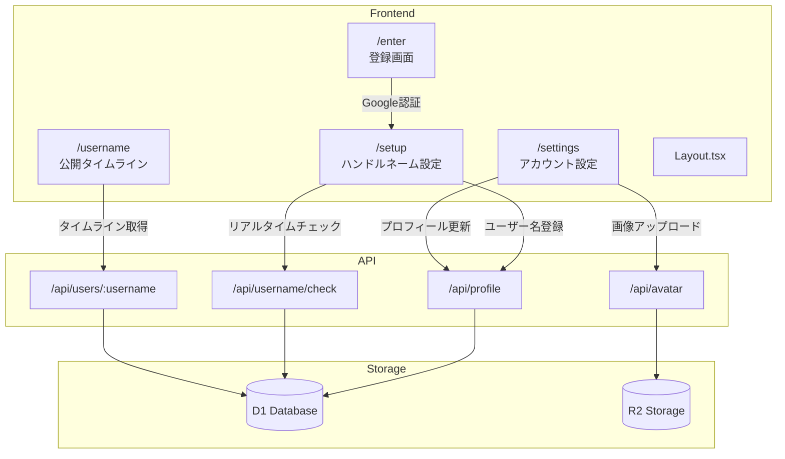
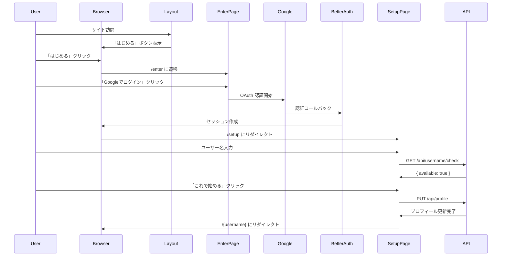

# Design Document: User Profile Setup

## Overview

ユーザーがサービス専用のユーザー名とアイコン画像を設定できる機能。Google 認証後のオンボーディングフローとして、ユーザー名設定を必須化し、アイコンは後からアカウント設定画面で変更可能とする。

ユーザー名は `/{username}` 形式の公開タイムライン URL に使用されるため、予約語との衝突を避けつつ一意性を保証する。

## Steering Document Alignment

### Technical Standards (tech.md)

- **Frontend**: React 19 + TypeScript 5.x、Tailwind CSS 4 を使用
- **Backend**: Hono 4 フレームワーク、Cloudflare Workers 上で動作
- **Database**: Cloudflare D1（SQLite）+ Drizzle ORM
- **Validation**: Zod によるスキーマバリデーション
- **Authentication**: Better Auth（既存実装を拡張）

### Project Structure (structure.md)

- ページコンポーネントは `src/pages/` に配置
- 共通コンポーネントは `src/components/common/` に配置
- API エンドポイントは `functions/api/` に配置
- カスタムフックは `src/hooks/` に配置
- 型定義は `src/types/index.ts` に集約

## Code Reuse Analysis

### Existing Components to Leverage

- **Layout.tsx**: ヘッダー構造を拡張し、未ログイン時の「はじめる」ボタンを追加
- **UserMenu.tsx**: アカウント設定へのリンクを追加
- **Input.tsx**: ユーザー名入力フィールドに使用
- **Button.tsx**: 各種ボタンに使用
- **Toast.tsx**: 成功/エラー通知に使用
- **Modal.tsx**: 確認ダイアログに使用

### Existing Hooks to Leverage

- **useAuth.ts**: ユーザー情報取得、認証状態管理を拡張

### Integration Points

- **Better Auth**: ユーザー認証フローに統合
- **D1 Database**: users テーブルにカラム追加
- **React Router**: 新規ルート追加

## Architecture



### Modular Design Principles

- **Single File Responsibility**: 各ページ、フック、API エンドポイントは単一の責務を持つ
- **Component Isolation**: フォーム部品（UsernameInput, AvatarUploader）は再利用可能に設計
- **Service Layer Separation**: API 通信は `src/services/profile.ts` に集約
- **Utility Modularity**: ユーザー名バリデーションは `src/lib/validation.ts` に追加

## Components and Interfaces

### Page Components

#### EnterPage (`src/pages/EnterPage.tsx`)
- **Purpose**: 新規ユーザー向け登録画面。サービス紹介と Google ログインボタンを表示
- **Route**: `/enter`
- **Dependencies**: `useAuth`, `LoginButton`

#### SetupPage (`src/pages/SetupPage.tsx`)
- **Purpose**: Google 認証後のハンドルネーム設定画面
- **Route**: `/setup`
- **Dependencies**: `useAuth`, `useUsernameValidation`, `Input`, `Button`

#### SettingsPage (`src/pages/SettingsPage.tsx`)
- **Purpose**: ログイン済みユーザーのアカウント設定画面
- **Route**: `/settings`
- **Dependencies**: `useAuth`, `useProfile`, `AvatarUploader`, `Input`, `Button`

#### PublicTimelinePage (`src/pages/PublicTimelinePage.tsx`)
- **Purpose**: ユーザーの公開タイムライン表示
- **Route**: `/:username`
- **Dependencies**: `usePublicTimeline`, `Timeline`

### UI Components

#### UsernameInput (`src/components/common/UsernameInput.tsx`)
- **Purpose**: ユーザー名入力フィールド（リアルタイムバリデーション付き）
- **Props**: `value`, `onChange`, `onValidationChange`, `disabled`
- **Features**: デバウンス付き利用可否チェック、エラー表示

#### AvatarUploader (`src/components/common/AvatarUploader.tsx`)
- **Purpose**: アバター画像アップロードコンポーネント
- **Props**: `currentImageUrl`, `onUpload`, `disabled`
- **Features**: プレビュー表示、ファイルサイズ/形式バリデーション

### Hooks

#### useUsernameValidation (`src/hooks/useUsernameValidation.ts`)
- **Purpose**: ユーザー名のクライアント/サーバーバリデーション
- **Returns**: `{ isValid, isChecking, error, checkUsername }`
- **Features**: デバウンス（300ms）、予約語チェック、一意性チェック

#### useProfile (`src/hooks/useProfile.ts`)
- **Purpose**: プロフィール取得・更新
- **Returns**: `{ profile, isLoading, updateUsername, updateAvatar }`

#### usePublicTimeline (`src/hooks/usePublicTimeline.ts`)
- **Purpose**: 公開タイムライン取得
- **Returns**: `{ user, logs, isLoading, error }`

### API Endpoints

#### GET /api/profile
- **Purpose**: 現在のユーザープロフィール取得
- **Auth**: Required
- **Response**: `{ id, username, name, email, image, avatarUrl, createdAt }`

#### PUT /api/profile
- **Purpose**: プロフィール更新（ユーザー名）
- **Auth**: Required
- **Body**: `{ username: string }`
- **Response**: `{ id, username, ... }`

#### GET /api/username/check
- **Purpose**: ユーザー名利用可否チェック
- **Auth**: Required
- **Query**: `username=xxx`
- **Response**: `{ available: boolean, reason?: string }`

#### POST /api/avatar
- **Purpose**: アバター画像アップロード
- **Auth**: Required
- **Body**: `multipart/form-data` (image file)
- **Response**: `{ avatarUrl: string }`

#### GET /api/users/:username
- **Purpose**: ユーザー情報取得（公開用）
- **Auth**: Not required
- **Response**: `{ id, username, name, avatarUrl }`

#### GET /api/users/:username/timeline
- **Purpose**: ユーザーの公開タイムライン取得
- **Auth**: Not required
- **Response**: `{ user, logs: LogWithBook[] }`

## Data Models

### Users Table (拡張)

```sql
-- 既存の users テーブルに追加するカラム
ALTER TABLE users ADD COLUMN username TEXT UNIQUE;
ALTER TABLE users ADD COLUMN avatar_url TEXT;

-- インデックス
CREATE UNIQUE INDEX idx_users_username ON users(username);
```

### TypeScript Types

```typescript
// src/types/index.ts に追加

export interface UserProfile {
  id: string;
  username: string | null;
  name: string;
  email: string;
  image: string | null;      // Google アカウントの画像
  avatarUrl: string | null;  // サービス用カスタムアバター
  createdAt: string;
}

export interface PublicUser {
  id: string;
  username: string;
  name: string;
  avatarUrl: string | null;
}

export interface UpdateProfileRequest {
  username: string;
}

export interface UsernameCheckResponse {
  available: boolean;
  reason?: 'taken' | 'reserved' | 'invalid';
}
```

### Reserved Usernames (予約語)

```typescript
// src/lib/reserved-usernames.ts

export const RESERVED_USERNAMES = [
  // Routes
  'enter', 'setup', 'settings', 'login', 'logout', 'auth',
  'books', 'logs', 'api', 'admin', 'help', 'about',
  // Common
  'user', 'users', 'profile', 'account', 'home', 'index',
  'new', 'edit', 'delete', 'create', 'update',
  // System
  'static', 'assets', 'public', 'private', 'internal',
  'null', 'undefined', 'true', 'false',
] as const;

export function isReservedUsername(username: string): boolean {
  return RESERVED_USERNAMES.includes(
    username.toLowerCase() as typeof RESERVED_USERNAMES[number]
  );
}
```

## Routing Strategy

### URL Structure

| Path | Component | Purpose |
|------|-----------|---------|
| `/enter` | EnterPage | 登録画面 |
| `/setup` | SetupPage | ハンドルネーム設定 |
| `/settings` | SettingsPage | アカウント設定 |
| `/:username` | PublicTimelinePage | 公開タイムライン |

### Route Priority

React Router でキャッチオールルート `/:username` を使用するため、ルート定義順序が重要:

```typescript
<Routes>
  {/* 固定ルートを先に定義 */}
  <Route path="/" element={<HomePage />} />
  <Route path="/enter" element={<EnterPage />} />
  <Route path="/setup" element={<SetupPage />} />
  <Route path="/settings" element={<SettingsPage />} />
  <Route path="/books/new" element={<BookRegistrationPage />} />
  <Route path="/books/:id" element={<BookDetailPage />} />

  {/* キャッチオールルートは最後に定義 */}
  <Route path="/:username" element={<PublicTimelinePage />} />
</Routes>
```

## Image Storage Strategy

### Cloudflare R2 を使用

```typescript
// wrangler.jsonc に追加
{
  "r2_buckets": [
    {
      "binding": "AVATAR_BUCKET",
      "bucket_name": "logbook-avatars"
    }
  ]
}
```

### Upload Flow

1. クライアントで画像を選択・プレビュー表示
2. クライアントで画像をリサイズ（最大 256x256）
3. `POST /api/avatar` で画像をアップロード
4. サーバーでファイル形式・サイズを検証
5. R2 に保存し、公開 URL を返却
6. users テーブルの `avatar_url` を更新

### Image Constraints

- 最大ファイルサイズ: 2MB
- 対応形式: JPEG, PNG, GIF, WebP
- 保存サイズ: 256x256 にリサイズ
- ファイル名: `{userId}.{ext}`

## Authentication Flow

### 初回登録フロー



### ユーザー名未設定ガード

```typescript
// src/components/common/RequireUsername.tsx

export function RequireUsername({ children }: { children: ReactNode }) {
  const { user, isLoading } = useAuth();
  const location = useLocation();

  if (isLoading) return <Loading />;

  // 未ログインまたはユーザー名設定済み
  if (!user || user.username) {
    return <>{children}</>;
  }

  // ユーザー名未設定: /setup にリダイレクト（/enter, /setup は除外）
  const allowedPaths = ['/enter', '/setup'];
  if (allowedPaths.includes(location.pathname)) {
    return <>{children}</>;
  }

  return <Navigate to="/setup" replace />;
}
```

## Error Handling

### Error Scenarios

1. **ユーザー名が既に使用されている**
   - **Handling**: API が `{ available: false, reason: 'taken' }` を返却
   - **User Impact**: 「このユーザー名は既に使用されています」と表示

2. **ユーザー名が予約語**
   - **Handling**: クライアント側で即座に検出、API でも検証
   - **User Impact**: 「このユーザー名は使用できません」と表示

3. **ユーザー名の形式が不正**
   - **Handling**: クライアント側でリアルタイムバリデーション
   - **User Impact**: 「英数字とアンダースコアのみ使用できます」等

4. **画像アップロード失敗**
   - **Handling**: エラーをキャッチし、ユーザーに通知
   - **User Impact**: 「画像のアップロードに失敗しました。再度お試しください」

5. **存在しないユーザー名でアクセス**
   - **Handling**: API が 404 を返却
   - **User Impact**: 404 エラーページを表示

6. **Race Condition（同時登録）**
   - **Handling**: DB の UNIQUE 制約でエラー、API が適切なエラーを返却
   - **User Impact**: 「このユーザー名は既に使用されています」と表示

## Testing Strategy

### Unit Testing

- **Validation Functions**: `isValidUsername`, `isReservedUsername` のテスト
- **Hooks**: `useUsernameValidation`, `useProfile` のモックテスト
- **Components**: `UsernameInput`, `AvatarUploader` のレンダリング・インタラクションテスト

### Integration Testing

- **API Endpoints**: `/api/profile`, `/api/username/check`, `/api/avatar` のテスト
- **Authentication Flow**: Google 認証後のリダイレクト動作テスト

### End-to-End Testing

- **初回登録フロー**: 「はじめる」→ Google 認証 → ユーザー名設定 → タイムライン
- **アイコン変更フロー**: 設定画面 → 画像アップロード → 反映確認
- **公開タイムラインアクセス**: `/{username}` でタイムライン表示
