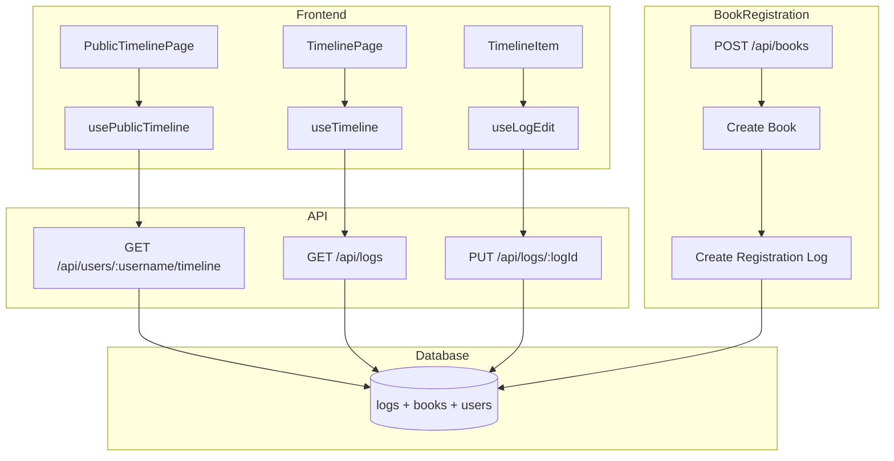

# Design Document: User Timeline

## Overview

ユーザーごとのタイムライン機能を実装し、`/{username}` で個人の読書記録を閲覧可能にする。既存の認証基盤（Better Auth）と公開タイムラインのルーティング・API を活用し、データベーススキーマにユーザー紐づけを追加する。また、本の登録時に「登録ログ」を自動作成し、ログのない本もタイムラインに表示可能にする。

## Steering Document Alignment

### Technical Standards (tech.md)

- **フレームワーク**: 既存の Hono + Cloudflare Workers を継続使用
- **ORM**: Drizzle ORM でマイグレーションを追加
- **認証**: Better Auth の既存実装を活用
- **バリデーション**: Zod スキーマを拡張

### Project Structure (structure.md)

- **API エンドポイント**: `functions/api/` 配下に追加・修正
- **フック**: `src/hooks/` に編集用フックを追加
- **コンポーネント**: `src/components/Timeline/` を拡張
- **型定義**: `src/types/index.ts` に登録ログ型を追加

## Code Reuse Analysis

### Existing Components to Leverage

- **usePublicTimeline**: 公開タイムラインのデータ取得（user フィルタ対応済みの構造）
- **useTimeline**: 認証済みユーザーのタイムライン（user_id フィルタを追加）
- **Timeline/TimelineGroup/TimelineItem**: タイムライン UI（登録ログ表示ルール追加）
- **useAuth**: 認証状態の取得（編集権限判定に使用）
- **LogForm**: ログ編集フォーム（編集モード対応に拡張）

### Integration Points

- **Better Auth**: 既存のセッション管理から user_id を取得
- **D1 Database**: books/logs テーブルに user_id カラムを追加
- **Public User API**: `/api/users/:username` でユーザー情報を取得（既存）
- **Public Timeline API**: `/api/users/:username/timeline` を実データ返却に修正

## Architecture



### Modular Design Principles

- **Single File Responsibility**: 登録ログ作成ロジックは `functions/lib/registrationLog.ts` に分離
- **Component Isolation**: ログ編集 UI は `LogEditForm.tsx` として独立コンポーネント化
- **Service Layer Separation**: ログ編集サービスは `src/services/logs.ts` に追加
- **Utility Modularity**: タイムライン表示判定ロジックは `src/lib/timeline.ts` に切り出し

## Components and Interfaces

### 1. Database Migration: Add user_id to books and logs

- **Purpose**: 本とログをユーザーに紐づける
- **Changes**:
  - `books` テーブルに `user_id` カラムを追加（NOT NULL, FK to users）
  - `logs` テーブルに `user_id` カラムを追加（NOT NULL, FK to users）
  - `logs` テーブルに `log_type` の選択肢として `registration` を追加
- **Reuses**: 既存の Drizzle マイグレーション構造

### 2. Registration Log Service (`functions/lib/registrationLog.ts`)

- **Purpose**: 本の登録時に自動で登録ログを作成
- **Interfaces**:
  ```typescript
  async function createRegistrationLog(
    db: DrizzleD1Database,
    bookId: string,
    userId: string
  ): Promise<Log>
  ```
- **Dependencies**: Drizzle ORM, logs table
- **Behavior**:
  - `log_type: 'registration'`
  - `content: '📖'`（はじまりの絵文字）
  - `created_at`: 本の登録日時と同一

### 3. Modified Books API (`functions/api/books/index.ts`)

- **Purpose**: 本の登録時にユーザー紐づけと登録ログ作成
- **Changes**:
  - POST: 認証ユーザーの user_id を本に設定
  - POST: 本の作成後に `createRegistrationLog()` を呼び出し
  - GET: 認証ユーザーの本のみを返却
- **Dependencies**: Better Auth session, registrationLog service

### 4. Modified Public Timeline API (`functions/api/users/[username]/timeline.ts`)

- **Purpose**: 指定ユーザーのタイムラインを返却
- **Changes**:
  - logs を user_id でフィルタ（現在の TODO 部分を実装）
  - LogWithBook 形式で返却
- **Reuses**: 既存の API 構造、usePublicTimeline フック

### 4.1. New Public Books API (`functions/api/users/[username]/books.ts`)

- **Purpose**: 指定ユーザーの本棚（登録済み書籍一覧）を返却
- **Endpoint**: `GET /api/users/:username/books`
- **Response**: 該当ユーザーの書籍一覧（Book 形式）
- **Behavior**:
  - username からユーザーを検索
  - 該当ユーザーの books を返却
  - ユーザーが存在しない場合は 404
- **Reuses**: 既存の books API 構造

### 5. Modified Logs API (`functions/api/logs/index.ts`, `[logId].ts`)

- **Purpose**: 認証ユーザーのログのみ操作可能に
- **Changes**:
  - GET: 認証ユーザーのログのみ返却
  - PUT: ログの所有者チェックを追加（403 if not owner）
  - DELETE: ログの所有者チェックを追加
- **Dependencies**: Better Auth session

### 6. Log Edit Hook (`src/hooks/useLogEdit.ts`)

- **Purpose**: ログの編集状態管理と保存
- **Interfaces**:
  ```typescript
  function useLogEdit(logId: string): {
    isEditing: boolean;
    editedContent: string;
    editedLogType: LogType;
    startEdit: () => void;
    cancelEdit: () => void;
    saveEdit: () => Promise<void>;
    isSaving: boolean;
    error: string | null;
  }
  ```
- **Dependencies**: logs service
- **Reuses**: 既存の API クライアント

### 7. TimelineItem Enhancement (`src/components/Timeline/TimelineItem.tsx`)

- **Purpose**: 編集ボタンの条件付き表示と編集モード
- **Changes**:
  - Props に `currentUserId` と `logUserId` を追加
  - 所有者のみに編集ボタンを表示
  - 編集モード時は `LogEditForm` を表示
- **Reuses**: 既存の TimelineItem 構造

### 8. Timeline Display Logic (`src/lib/timeline.ts`)

- **Purpose**: 登録ログのフィルタリング
- **Interfaces**:
  ```typescript
  function filterRegistrationLogs(logs: Log[]): Log[]
  // 登録ログを除外したログ配列を返す（タイムライン表示用）

  function isRegistrationLogOnly(logs: Log[]): boolean
  // 登録ログのみの場合 true（本の表紙のみ表示するケース）

  function hasNonRegistrationLogs(logs: Log[]): boolean
  // 登録ログ以外のログが存在するか判定
  ```
- **Dependencies**: Log type
- **Note**: 登録ログは常にタイムラインに表示しない（分岐なし）

### 9. TimelineGroup Enhancement (`src/components/Timeline/TimelineGroup.tsx`)

- **Purpose**: 登録ログを除外したタイムライン表示
- **Changes**:
  - `filterRegistrationLogs()` で登録ログを常に除外してから表示
  - `isRegistrationLogOnly()` で判定し、登録ログのみの場合は本の表紙と基本情報のみ表示
  - 他のログがある場合は登録ログを除外して表示（登録ログは表示しない）
- **Reuses**: 既存の TimelineGroup、BookCover

### 10. PublicTimelinePage Layout (`src/pages/PublicTimelinePage.tsx`)

- **Purpose**: ユーザータイムラインを HomePage と同じレイアウトで表示
- **Changes**:
  - HomePage と同じ要素・レイアウトを使用
    - UserInfo（対象ユーザーの情報を表示）
    - HeaderActionButtons（自分のタイムラインの場合のみ「ログを追加」ボタン表示）
    - TabNavigation（タイムライン/本棚の切り替え）
    - TimelineView / BookListView（タブに応じてコンテンツを切り替え）
  - 他人のタイムラインでは「ログを追加」ボタンを非表示
  - 既存の usePublicTimeline を拡張して本棚データも取得
- **Reuses**: HomePage のコンポーネント構成（UserInfo, HeaderActionButtons, TabNavigation, TimelineView, BookListView）
- **New Hook**: `usePublicUserData` - 公開ユーザーのタイムラインと本棚データを統合取得

### 11. TimelineEmpty Enhancement (`src/components/Timeline/TimelineEmpty.tsx`)

- **Purpose**: 空のタイムライン/本棚を閲覧者に応じて適切に表示
- **Changes**:
  - Props に `isOwner` と `username` を追加
  - 所有者の場合: 「本を登録する」ボタンを表示
  - 他人の場合: メッセージのみを表示（ボタンは非表示）
  - `variant` Props で「timeline」または「books」を切り替え
- **Interfaces**:
  ```typescript
  interface TimelineEmptyProps {
    variant: 'timeline' | 'books';
    isOwner: boolean;
    username?: string;  // 他人のタイムラインの場合に使用
  }
  ```
- **Display Logic**:
  | variant | isOwner | 表示内容 |
  |---------|---------|---------|
  | timeline | true | 「まだ読書ログがありません」+ 「本を登録する」ボタン |
  | timeline | false | 「@{username}さんはまだ読書ログを投稿していません」 |
  | books | true | 「まだ本がありません」+ 「本を登録する」ボタン |
  | books | false | 「@{username}さんはまだ本を登録していません」 |
- **Reuses**: 既存の TimelineEmpty のスタイル、Link コンポーネント

## Data Models

### Log (Updated)

```typescript
interface Log {
  id: string;           // UUID
  bookId: string;       // FK to books
  userId: string;       // FK to users (NEW)
  logType: 'memo' | 'quote' | 'registration';  // registration 追加
  content: string;      // 1-10,000 chars
  page?: number;        // optional page number
  createdAt: string;    // ISO datetime
  updatedAt: string;    // ISO datetime
}
```

### Book (Updated)

```typescript
interface Book {
  id: string;           // UUID
  userId: string;       // FK to users (NEW)
  title: string;
  author: string;
  publisher?: string;
  isbn?: string;
  coverUrl?: string;
  ndlBibId?: string;
  isDeleted: boolean;
  createdAt: string;
  updatedAt: string;
}
```

### LogType (Updated)

```typescript
type LogType = 'memo' | 'quote' | 'registration';
```

### Database Migration

```sql
-- Migration: add_user_id_to_books_and_logs

ALTER TABLE books ADD COLUMN user_id TEXT NOT NULL
  REFERENCES users(id) ON DELETE CASCADE;

ALTER TABLE logs ADD COLUMN user_id TEXT NOT NULL
  REFERENCES users(id) ON DELETE CASCADE;

-- Add index for user queries
CREATE INDEX idx_books_user_id ON books(user_id);
CREATE INDEX idx_logs_user_id ON logs(user_id);

-- Update log_type check constraint to include 'registration'
-- (D1/SQLite handles this via application logic with Drizzle enum)
```

## Error Handling

### Error Scenarios

1. **ユーザーが存在しない（404）**
   - **Handling**: `usePublicTimeline` で `isNotFound` フラグを設定
   - **User Impact**: 「ユーザーが見つかりません」エラーページを表示

2. **他人のログを編集しようとする（403）**
   - **Handling**: API で所有者チェック、403 Forbidden を返却
   - **User Impact**: UIでは編集ボタン非表示のため通常到達しない。API直接呼び出し時のみ発生

3. **登録ログ作成失敗**
   - **Handling**: 本の登録は成功させ、ログ作成エラーはログ出力のみ
   - **User Impact**: 本は登録されるが登録ログがない状態。後から手動でログ追加可能

4. **ログ編集中のネットワークエラー**
   - **Handling**: エラーメッセージ表示、編集内容は保持
   - **User Impact**: 「保存に失敗しました」トースト表示、リトライ可能

5. **認証切れ**
   - **Handling**: 401 エラー時にログインページへリダイレクト
   - **User Impact**: 自動的にログインページへ遷移

## Testing Strategy

### Unit Testing

- `src/lib/timeline.ts` の表示判定ロジック
  - `shouldShowRegistrationLog()`: 各パターンのテスト
  - `isRegistrationLogOnly()`: 境界値テスト
- `functions/lib/registrationLog.ts` の登録ログ作成
- Zod スキーマのバリデーションテスト

### Integration Testing

- **Books API**: 本登録時に登録ログが自動作成されることを確認
- **Logs API**: 所有者チェックが正しく動作することを確認
- **Public Timeline API**: ユーザーでフィルタされたログが返ることを確認

### End-to-End Testing

1. **ユーザー登録→本登録→タイムライン確認**
   - 本を登録すると登録ログが自動作成される
   - タイムラインに本の表紙のみ表示される（ログは非表示）

2. **ログ追加→タイムライン更新**
   - メモを追加すると登録ログも表示される
   - グループ表示で本と複数ログが表示される

3. **ログ編集フロー**
   - 自分のログに編集ボタンが表示される
   - 編集して保存すると内容が更新される
   - 他人のタイムラインでは編集ボタンが表示されない

4. **公開タイムライン閲覧**
   - `/{username}` でそのユーザーのログのみ表示される
   - 存在しないユーザーで404ページが表示される
